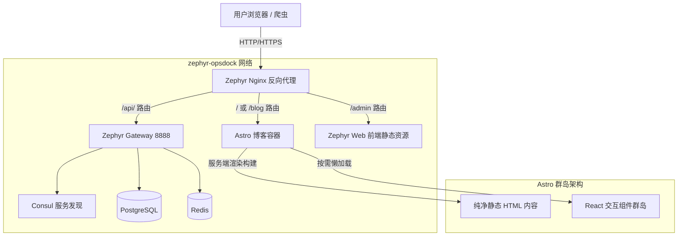

# Zephyr 博客系统架构设计文档

## 1. 整体架构概述

基于现有的 Zephyr Admin 基础设施，前台博客页面采用 **Astro + React** 集成方案，构建以内容驱动、追求极致性能和优秀 SEO 的门户网站。

核心架构特点：
- **核心框架**：Astro 负责静态站点生成 (SSG) / 服务端渲染 (SSR) 和整体路由，提供默认零 JS 的极速页面加载。
- **动态组件**：React 负责复杂交互组件 (如：评论、点赞、阅读进度条等)，通过 Astro 的群岛架构 (`Islands Architecture`) 实现按需加载 (Partial Hydration)。
- **后端对接**：通过统一的 Go-Zero 网关 `zephyr-gateway` 获取动态文章数据、专栏信息和用户交互数据。
- **部署发布**：通过 Docker 容器化打包，无缝部署至现有的 `zephyr-opsdock` 网络中，由 Nginx 统一进行流量代理分发。

---

## 2. 技术选型详情

| 领域 | 技术方案 | 优势说明 |
|------|---------|---------|
| 核心框架 | Astro | 极致性能，默认零 JS，天然适合内容驱动的博客页面，SEO 极佳。 |
| 交互组件 | React + Hooks | 完美复用原有 `zephyr-web` 的开发经验与基础组件库，开发效率高。 |
| 样式方案 | TailwindCSS | 原生集成，与 `zephyr-web` 保持原子化 CSS 体系一致，方便统一设计语言。 |
| 内容来源 | API / MDX | 支持从 `zephyr-go` 拉取动态文章，也支持本地 MDX 结合 React 组件写作。 |
| 部署环境 | Docker + Nginx | 完全融入现有 opsdock 体系，运维成本低。 |

---

## 3. 架构拓扑图



---

## 4. 关键技术点与解决方案

### 4.1 Astro 群岛架构 (Islands Architecture)
Astro 允许我们在静态的 HTML 页面中嵌入动态的 React 组件。只有当需要交互时，才会加载和执行对应的 React 代码。
- **静态部分**：文章正文、全局导航栏、页脚等，由 Astro 在服务端直接渲染为纯 HTML。
- **动态岛 (Islands)**：
  - `<CommentBox client:visible />`：评论组件，当用户滚动到可视区域时才加载 JS。
  - `<LikeButton client:load />`：点赞组件，页面加载完成后立即激活。

### 4.2 数据获取与 SEO 优化
由于博客强依赖 SEO，数据获取将主要在 Astro 的服务端构建生命周期中进行：
```astro
---
// src/pages/article/[id].astro
// 这段代码只在服务端运行，不会打包到客户端
const { id } = Astro.params;
// 直接请求内网的 Go Gateway
const response = await fetch(`http://zephyr-gateway:8888/api/v1/article/${id}`);
const articleData = await response.json();
---

<html>
  <head><title>{articleData.title}</title></head>
  <body>
    <h1>{articleData.title}</h1>
    <div set:html={articleData.content} />
    <!-- 动态的 React 组件 -->
    <LikeButton articleId={id} client:visible />
  </body>
</html>
```
搜索引擎爬虫抓取到的将是包含完整标题和正文的纯 HTML 页面。

### 4.3 与现有的 Zephyr 后端打通
1. **内网调用**：Astro 容器与 Go 微服务同处 `opsdock_default` 网络，服务端数据请求直接走内网，降低延迟。
2. **鉴权共享**：如果博客开放用户登录和评论功能，可采用和后台一致的 JWT Token 机制。React 组件在客户端发起请求时携带 Token。

---

## 5. 容器化部署方案

为了融入现有的 Docker 体系，博客项目（例如命名为 `zephyr-blog`）的部署流程如下：

1. **镜像构建**：
   博客应用打包为一个基于 Node.js/Alpine 的 Docker 镜像。根据 Astro 的适配器，通常通过运行 Node server 来提供 SSR 服务。
2. **加入 Compose**：
   在现有的 `docker-compose.yml` 中新增一个 `zephyr-blog` 服务，挂载到同一个 network。
3. **Nginx 配置更新**：
   在 `${DATA_DIR}/nginx/conf.d/default.conf` 中新增路由规则，将根路径 `/` 的流量代理给博客容器：
   ```nginx
   location / {
       resolver 127.0.0.11 valid=10s;
       set $blog_target http://zephyr-blog:4321;
       proxy_pass $blog_target;
       proxy_set_header Host $host;
   }
   ```
